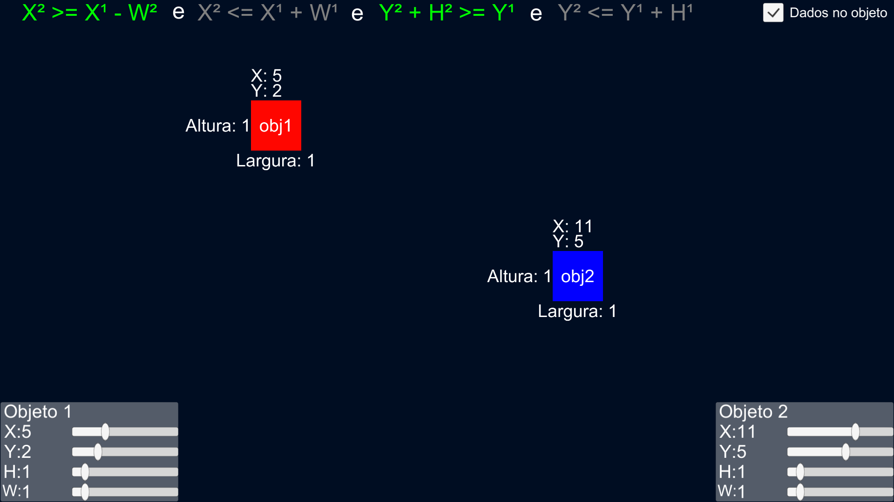

<h1 align="center">Colisoes</h1>

 
  
   
  

## **💻 Projeto**
Este projeto tem como intuito demonstrar como funciona a lógica de uma fórmula simples de detecção de colisões entre dois objetos em Love for Lua.

## **🔖 Layout**

  

## **💻 Tecnologias**
- **[Unity Engine 2019.4.21f1](https://www.unity.com/pt)**

## **👨‍🚀 Autor**

<a href="https://github.com/caiovsoares">
 
 <b>Caio Vinicius Amancio Soares</b>
</a>
  
  
 

